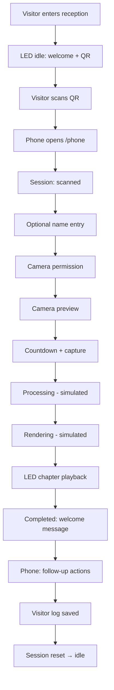
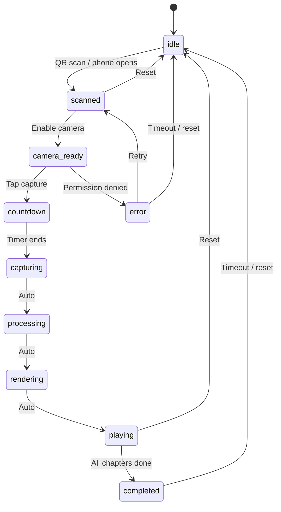
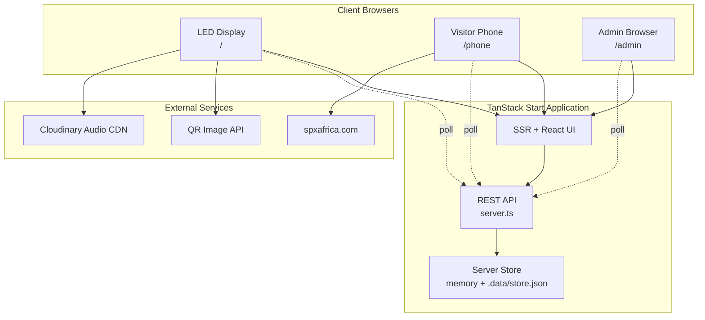
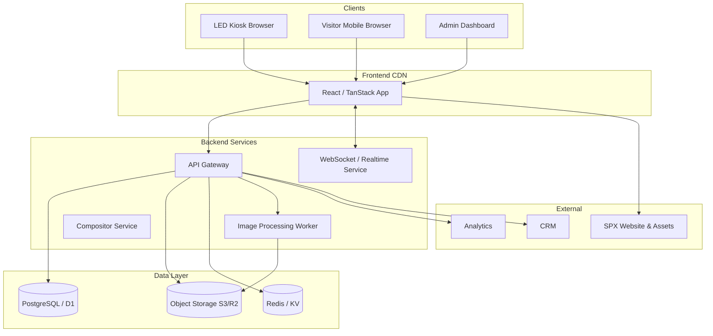
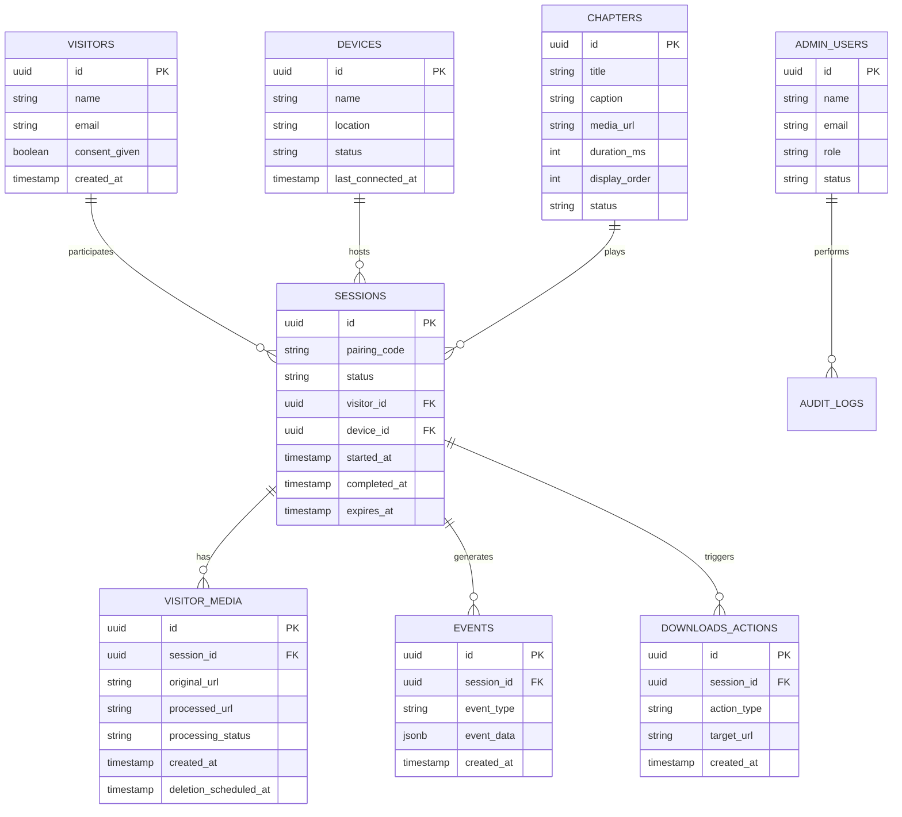
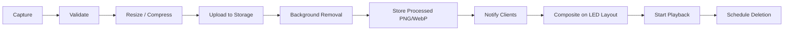

# SPX Cinematic Welcome Experience — Project Documentation

---

## Table of Contents

1. [Document Information](#1-document-information)
2. [Executive Summary](#2-executive-summary)
3. [Project Vision](#3-project-vision)
4. [Business Objectives](#4-business-objectives)
5. [Scope of the Project](#5-scope-of-the-project)
6. [Stakeholders and User Roles](#6-stakeholders-and-user-roles)
7. [Complete Visitor Journey](#7-complete-visitor-journey)
8. [User Experience Principles](#8-user-experience-principles)
9. [Functional Requirements](#9-functional-requirements)
10. [Non-Functional Requirements](#10-non-functional-requirements)
11. [Performance Targets](#11-performance-targets)
12. [Application State Machine](#12-application-state-machine)
13. [Screen Documentation](#13-screen-documentation)
14. [UI Layout and Visual Design](#14-ui-layout-and-visual-design)
15. [Branding Guidelines](#15-branding-guidelines)
16. [Theme System](#16-theme-system)
17. [Animation and Motion System](#17-animation-and-motion-system)
18. [Cinematic Chapter Model](#18-cinematic-chapter-model)
19. [System Architecture](#19-system-architecture)
20. [Real-Time Communication](#20-real-time-communication)
21. [Backend API Specification](#21-backend-api-specification)
22. [Database Design](#22-database-design)
23. [Project Folder Structure](#23-project-folder-structure)
24. [Component Architecture](#24-component-architecture)
25. [Camera and Portrait Capture](#25-camera-and-portrait-capture)
26. [Background Removal and Rendering](#26-background-removal-and-rendering)
27. [LED Screen and Hardware Requirements](#27-led-screen-and-hardware-requirements)
28. [Operator and Admin Dashboard](#28-operator-and-admin-dashboard)
29. [Analytics and Reporting](#29-analytics-and-reporting)
30. [Security Requirements](#30-security-requirements)
31. [Privacy and Consent](#31-privacy-and-consent)
32. [Accessibility](#32-accessibility)
33. [Browser and Device Compatibility](#33-browser-and-device-compatibility)
34. [Error Handling](#34-error-handling)
35. [Loading, Empty, and Offline States](#35-loading-empty-and-offline-states)
36. [Testing Strategy](#36-testing-strategy)
37. [Deployment Guide](#37-deployment-guide)
38. [Environment Variables](#38-environment-variables)
39. [Monitoring and Logging](#39-monitoring-and-logging)
40. [Development Standards](#40-development-standards)
41. [Known Limitations](#41-known-limitations)
42. [Recommended Next Steps](#42-recommended-next-steps)
43. [Development Roadmap](#43-development-roadmap)
44. [Acceptance Criteria](#44-acceptance-criteria)
45. [Glossary](#45-glossary)
46. [Final Project Summary](#46-final-project-summary)

---

## 1. Document Information

| Field | Value |
|---|---|
| **Project name** | SPX Cinematic Welcome Experience |
| **Document title** | SPX Cinematic Welcome — Comprehensive Project Documentation |
| **Version** | 1.0.0 |
| **Document status** | Draft — reflects current prototype and proposed production plan |
| **Intended audience** | Developers, project managers, UI/UX designers, SPX stakeholders, system administrators, investors, non-technical team members |
| **Last updated** | 13 July 2026 |
| **Prepared by** | [Project Team / Technical Documentation — placeholder] |
| **Project type** | Interactive reception and brand experience platform |
| **Technology category** | Web application (SPA/SSR hybrid), real-time visitor experience, digital signage integration |

> **Note:** Placeholder fields should be updated by the SPX project owner before external distribution.

---

## 2. Executive Summary

The **SPX Cinematic Welcome Experience** is an interactive digital reception system designed for SPX headquarters and flagship locations. A large **LED screen** (LED wall) installed behind the reception desk displays cinematic SPX content, a welcome message, and a **QR code** (Quick Response code — a scannable square barcode). Visitors scan the code with their smartphone and enter a browser-based experience — **no app download required**.

On their phone, visitors can optionally enter their name, grant camera access, capture a portrait, and follow a short guided flow. While the visitor waits, the system prepares a personalized cinematic presentation. The LED wall then plays a sequence of SPX brand chapters, incorporating the visitor's portrait into the display. After the presentation, the visitor receives follow-up actions on their phone: download the company profile, visit the SPX website, explore projects, and connect with SPX.

### Why this project exists

SPX wants its reception area to do more than display static branding. The experience should:

- Welcome visitors in a memorable, modern way
- Communicate SPX's breadth across industries and regions
- Encourage deeper engagement with SPX services and projects
- Support future lead generation and follow-up

### Where it will be used

- SPX reception areas (primary use case: Addis Ababa, Ethiopia — placeholder for additional sites)
- Corporate events, partner visits, and investor meetings
- Future deployments at SPX project sites or exhibitions

### Current prototype status

The application is a **polished, functional prototype** with real multi-route architecture, camera capture, cross-device session synchronization, a basic admin dashboard, and server-backed visitor logging. Several production features — including true background removal, dedicated WebSocket pairing, full analytics, CRM integration, and durable cloud persistence — are **planned but not yet complete**.

### Long-term product vision

A production-ready platform where every SPX reception desk becomes a living brand touchpoint: visitors are welcomed personally, SPX's story is told cinematically, engagement is measured, and follow-up actions are tracked — all while respecting privacy and operating reliably on dedicated hardware.

---

## 3. Project Vision

The vision is to transform the SPX reception area from a passive waiting space into an **interactive digital brand experience**.

Visitors should feel:

| Feeling | How the experience supports it |
|---|---|
| **Welcomed** | Personalized greeting, optional name on screen, warm cinematic tone |
| **Curious** | QR invitation, mystery of "seeing yourself in the film" |
| **Impressed** | Large-format LED presentation, polished motion design, chapter storytelling |
| **Connected to SPX** | Projects, contact details, and company profile at the end |
| **Interested in SPX services** | Chapter themes map to SPX capabilities; post-experience CTAs drive exploration |

The experience should feel premium, fast, and effortless — like stepping into a short film, not filling out a form.

---

## 4. Business Objectives

| # | Objective | Description |
|---|---|---|
| BO-01 | Modernize reception | Replace static signage with an interactive, memorable welcome |
| BO-02 | Strengthen brand communication | Present SPX identity through cinematic storytelling |
| BO-03 | Increase visitor engagement | Invite participation via QR and personal portrait |
| BO-04 | Showcase projects and capabilities | Six thematic chapters highlight SPX sectors |
| BO-05 | Generate qualified leads | Capture interest through profile downloads and contact actions |
| BO-06 | Drive company-profile downloads | Offer downloadable SPX company profile PDF |
| BO-07 | Drive website visits | Link to official SPX web properties |
| BO-08 | Collect interaction analytics | Measure scans, completions, drop-offs (planned) |
| BO-09 | Improve brand memorability | Create a distinctive "I was on the SPX screen" moment |
| BO-10 | Support follow-up | Visitor log and engagement data for marketing/sales (planned) |

---

## 5. Scope of the Project

### 5.1 Current Prototype Scope

> **Status:** Implemented in the current codebase unless marked *simulated*.

| Area | Current capability |
|---|---|
| Multi-route web app | `/` (LED wall), `/phone` (mobile flow), `/admin` (dashboard) |
| LED wall display | Cinematic background, welcome content, QR code, chapter playback |
| Mobile visitor flow | Name entry, camera, capture, processing UI, completed actions |
| QR code | Real QR encoding `/phone` URL (via external QR image service) |
| Camera access | Real browser camera via `getUserMedia()` |
| Portrait capture | Real JPEG capture via canvas |
| Processing & rendering | *Simulated* with timed UI states |
| Chapter playback | Six chapters with timed advancement (~3.2s each) |
| Cross-device sync | Server-backed session API with client polling (750ms) |
| Theme switching | Light and dark themes with localStorage persistence |
| Admin dashboard | PIN login, visitor log, live session control, CSV export |
| Visitor logging | Server-side on session completion (up to 500 records) |
| Persistence | File-based `.data/store.json` on Node; in-memory on Cloudflare edge |
| Post-experience actions | Website link, company profile PDF, projects overlay, contact overlay |
| Session reset | Automatic timeouts + manual reset from wall, phone, or admin |
| Operator controls | Live state override, chapter control, session reset in admin |

### 5.2 Planned Production Scope

| Area | Planned capability |
|---|---|
| Session-specific QR pairing | Unique session ID per visitor |
| WebSocket / SSE sync | Replace polling for lower latency |
| Real background removal | Image processing pipeline |
| Object storage | S3, R2, or Cloudinary for photos |
| Relational database | Postgres, D1, or Supabase |
| Full analytics | Event tracking, dashboards, trends |
| CRM integration | Export leads to CRM (placeholder vendor) |
| Consent workflow | Formal privacy consent and retention controls |
| Media management | Admin-managed chapters, audio, and assets |
| Multi-site support | Multiple LED devices and locations |
| Maintenance mode | Operator-controlled idle override |

### 5.3 Out of Scope for the Current Prototype

- Native mobile apps (iOS/Android)
- Offline-first mobile experience
- Multi-visitor concurrent sessions on one LED
- Real-time video streaming to LED
- AI-generated personalized video per visitor
- Payment or booking flows
- Full CRM implementation
- Legal-grade privacy compliance without review

---

## 6. Stakeholders and User Roles

### 6.1 Visitor

| Aspect | Detail |
|---|---|
| **Responsibilities** | Scan QR, participate in flow, optionally provide name and portrait |
| **System access** | `/phone` route on personal smartphone browser |
| **Key actions** | Enter name, enable camera, capture portrait, view follow-up links |
| **Limitations** | Cannot control LED directly; cannot access admin |

### 6.2 Receptionist

| Aspect | Detail |
|---|---|
| **Responsibilities** | Greet visitors, encourage participation, assist with camera permission issues |
| **System access** | Physical reception area; may open `/` on LED machine |
| **Key actions** | Direct visitors to scan QR; call operator if session stuck |
| **Limitations** | No admin access by default |

### 6.3 Operator

| Aspect | Detail |
|---|---|
| **Responsibilities** | Monitor live session, reset stuck sessions, assist during events |
| **System access** | `/admin` (Live Control tab) after PIN login |
| **Key actions** | View state, jump states, reset session, skip chapters |
| **Limitations** | Cannot edit chapter content in current prototype |

### 6.4 Administrator

| Aspect | Detail |
|---|---|
| **Responsibilities** | Manage visitor data, configure environment, oversee system health |
| **System access** | `/admin` full dashboard |
| **Key actions** | View/export visitor log, clear records, configure PIN via env |
| **Limitations** | No user management UI yet; PIN is single shared secret |

### 6.5 Marketing Team

| Aspect | Detail |
|---|---|
| **Responsibilities** | Chapter content, company profile, project descriptions, CTAs |
| **System access** | Content files and future CMS (not yet built) |
| **Key actions** | Update chapter images, PDF, project copy, contact details |
| **Limitations** | Content currently hardcoded in source files |

### 6.6 Technical Support Team

| Aspect | Detail |
|---|---|
| **Responsibilities** | LED hardware, network, browser kiosk, server deployment |
| **System access** | Hosting platform, environment variables, logs |
| **Key actions** | Deploy updates, monitor uptime, troubleshoot camera/network issues |
| **Limitations** | No built-in device monitoring dashboard yet |

---

## 7. Complete Visitor Journey

### 7.1 Step-by-Step Journey

1. Visitor enters the SPX reception area.
2. Visitor sees the large LED wall behind the reception desk.
3. LED displays idle cinematic visuals, SPX branding, welcome message, and QR code.
4. QR code invites the visitor to begin the experience.
5. Visitor scans the QR code with their phone camera.
6. Mobile browser opens the `/phone` route (no app install).
7. Phone connects to the shared server session; LED shows "connected" state.
8. Visitor reads the welcome introduction on their phone.
9. Visitor optionally enters their first name (max 24 characters).
10. Visitor taps "Enable camera."
11. Browser requests camera permission.
12. Camera preview opens (front-facing, mirrored for selfie alignment).
13. Visitor aligns their face within the on-screen guide frame.
14. Visitor taps capture; a 3-second countdown begins.
15. Portrait is captured to JPEG (base64 data URL).
16. Image is sent to the server session via API (*stored in session, not separate upload endpoint yet*).
17. Phone and LED show processing states (*simulated* background removal).
18. LED shows rendering / assembly state (*simulated*).
19. Cinematic chapter playback begins on the LED.
20. Visitor portrait appears on the LED during playback.
21. Six chapters play sequentially with titles and captions.
22. Final welcome message appears on LED ("Welcome, [Name]").
23. Phone shows completed screen with souvenir image and action buttons.
24. Visitor may save souvenir, visit website, download profile, explore projects, or contact SPX.
25. Visitor taps "End session" or waits for automatic reset.
26. Visitor record is saved server-side (name, photo, duration, timestamp).
27. LED automatically returns to idle after timeout (30s after completed, 90s if stuck).

### 7.2 Visitor Journey Flow Diagram



---

## 8. User Experience Principles

| Principle | Application |
|---|---|
| **Simple** | Minimal steps; one primary action per screen |
| **Fast** | Short countdown, timed chapters, automatic progression |
| **Visually impressive** | Cinematic aspect ratio, Ken Burns backgrounds, vignette, grain |
| **Minimal instructions** | Short labels; visual guides over long text |
| **No app download** | Standard mobile browser only |
| **Mobile-first** | Phone flow optimized for portrait, 16px inputs (prevents iOS zoom) |
| **Clear privacy communication** | Photo-use notice on phone (consent workflow planned) |
| **Friendly error messages** | Plain language for camera denial |
| **Smooth transitions** | CSS animations with cinematic easing |
| **Accessible controls** | Large tap targets on phone; theme contrast improvements ongoing |
| **Safe automatic reset** | Timeouts prevent stuck sessions on public display |
| **Consistent SPX branding** | SPX mark, mono labels, primary accent, display typography |

---

## 9. Functional Requirements

### 9.1 LED Idle Experience

| ID | Requirement | Status |
|---|---|---|
| FR-001 | Display cinematic background media on LED | Implemented |
| FR-002 | Display scannable QR code linking to `/phone` | Implemented |
| FR-003 | Display welcome message and instructions | Implemented |
| FR-004 | Loop ambient idle visuals | Implemented (chapter imagery, desaturated) |
| FR-005 | Show connected state when phone session active | Implemented |

### 9.2 QR and Session Pairing

| ID | Requirement | Status |
|---|---|---|
| FR-010 | Generate QR code for mobile route | Implemented |
| FR-011 | Open correct mobile URL on scan | Implemented |
| FR-012 | Link phone session to LED via shared server state | Implemented (polling) |
| FR-013 | Prevent two visitors controlling same session | Partial — single global session |
| FR-014 | Expire inactive sessions | Implemented (90s stuck / 30s completed) |
| FR-015 | Session-specific QR per visitor | Planned |

### 9.3 Visitor Information

| ID | Requirement | Status |
|---|---|---|
| FR-020 | Optional name entry | Implemented |
| FR-021 | Validate input length (24 chars) | Implemented |
| FR-022 | Store visitor consent | Planned |
| FR-023 | Allow anonymous participation | Implemented (name optional) |

### 9.4 Camera

| ID | Requirement | Status |
|---|---|---|
| FR-030 | Request camera permission | Implemented |
| FR-031 | Use front-facing camera | Implemented |
| FR-032 | Show mirrored preview | Implemented |
| FR-033 | Show face-positioning guide | Implemented (corner brackets) |
| FR-034 | Capture portrait to JPEG | Implemented |
| FR-035 | Allow retake | Partial — error reset only |
| FR-036 | Handle denied permission | Implemented (error state) |

### 9.5 Processing

| ID | Requirement | Status |
|---|---|---|
| FR-040 | Upload photo to backend | Partial — embedded in session API |
| FR-041 | Display progress UI | Implemented (simulated) |
| FR-042 | Remove background | Simulated |
| FR-043 | Generate optimized cut-out | Simulated |
| FR-044 | Handle processing failures | Planned |

### 9.6 Playback

| ID | Requirement | Status |
|---|---|---|
| FR-050 | Start presentation automatically | Implemented |
| FR-051 | Display six chapters sequentially | Implemented |
| FR-052 | Synchronize chapter timing | Implemented (server session + ~3.2s interval) |
| FR-053 | Display visitor portrait on LED | Implemented |
| FR-054 | Display chapter title and caption | Implemented |
| FR-055 | Complete presentation automatically | Implemented |

### 9.7 Post-Experience Actions

| ID | Requirement | Status |
|---|---|---|
| FR-060 | Visit SPX website | Implemented (`https://spxafrica.com/`) |
| FR-061 | Download company profile | Implemented (`/spx-company-profile.pdf`) |
| FR-062 | Explore projects | Implemented (overlay with project list) |
| FR-063 | Contact SPX | Implemented (overlay with contact details) |
| FR-064 | Save souvenir image | Implemented (download link) |
| FR-065 | Share experience | Planned |

### 9.8 Session Reset

| ID | Requirement | Status |
|---|---|---|
| FR-070 | End active session | Implemented |
| FR-071 | Clear visitor photo from screen | Implemented |
| FR-072 | Clear temporary session data | Implemented |
| FR-073 | Return LED to idle | Implemented |
| FR-074 | Notify phone when wall resets | Implemented (session ended screen) |

### 9.9 Operator Functions

| ID | Requirement | Status |
|---|---|---|
| FR-080 | View active state | Implemented (admin) |
| FR-081 | Jump to any state | Implemented |
| FR-082 | Skip / change chapter | Implemented |
| FR-083 | Restart experience | Implemented |
| FR-084 | Reset session | Implemented |
| FR-085 | Pause presentation | Planned |
| FR-086 | Maintenance mode | Planned |

---

## 10. Non-Functional Requirements

| ID | Category | Requirement |
|---|---|---|
| NFR-001 | Performance | Phone route interactive within 3s on 4G *(suggested target)* |
| NFR-002 | Performance | Session sync latency under 1s *(polling at 750ms)* |
| NFR-003 | Security | HTTPS required for camera in production |
| NFR-004 | Security | Admin routes protected by PIN + HttpOnly cookie |
| NFR-005 | Privacy | Photo used only for stated purpose; retention policy needed |
| NFR-006 | Availability | Reception-hours uptime 99%+ *(production target)* |
| NFR-007 | Reliability | Graceful degradation if API unavailable |
| NFR-008 | Scalability | Support single concurrent session per installation *(current)* |
| NFR-009 | Accessibility | WCAG 2.1 AA alignment *(target; partial today)* |
| NFR-010 | Browser compatibility | Chrome, Safari mobile primary; see Section 33 |
| NFR-011 | Maintainability | TypeScript strict mode; ESLint + Prettier |
| NFR-012 | Observability | Server error logging; full APM planned |
| NFR-013 | Responsiveness | Mobile portrait; LED 21:9 cinematic aspect |
| NFR-014 | Data retention | Visitor log capped at 500 records; policy TBD |

---

## 11. Performance Targets

> **Note:** Values marked *suggested* are targets for production approval, not yet benchmarked.

| Metric | Suggested target | Current prototype |
|---|---|---|
| QR page load time | < 2s on 4G | Depends on hosting |
| Session pairing time | < 1s | ~750ms–1.5s (polling) |
| Camera startup time | < 3s | Browser-dependent |
| Photo upload time | < 2s | Inline in session POST |
| Background removal time | < 8s | Simulated ~3s |
| Rendering time | < 3s | Simulated ~1.8s |
| LED playback smoothness | 60fps UI animations | CSS animations |
| Session reset time | < 1s | Implemented |
| API response time | < 200ms p95 | In-memory / file store |
| Maximum concurrent sessions | 1 per install *(current)* | 1 global session |

---

## 12. Application State Machine

### 12.1 State Type Definition

```ts
type ExperienceState =
  | "idle"
  | "scanned"
  | "camera_ready"
  | "countdown"
  | "capturing"
  | "processing"
  | "rendering"
  | "playing"
  | "completed"
  | "error";
```

### 12.2 State Reference

#### `idle`

| Aspect | Detail |
|---|---|
| **Purpose** | Ambient standby; awaiting next visitor |
| **Visitor (phone)** | Not active, or shows session-ended if previously active |
| **LED** | Welcome visuals, QR code, desaturated chapter background |
| **Actions** | Scan QR; operator manual "Start" on wall |
| **Auto transition** | → `scanned` when phone opens `/phone` or wall simulates scan |
| **Next state** | `scanned` |

#### `scanned`

| Aspect | Detail |
|---|---|
| **Purpose** | Mobile session linked; onboarding |
| **Visitor** | Welcome screen, optional name, "Enable camera" |
| **LED** | "Connected" indicator, QR area shows route active |
| **Actions** | Enter name, proceed to camera |
| **Auto transition** | None |
| **Next state** | `camera_ready` |

#### `camera_ready`

| Aspect | Detail |
|---|---|
| **Purpose** | Live camera preview active |
| **Visitor** | Mirrored preview, framing guides, capture button |
| **LED** | "Hold still. The film is rolling." |
| **Actions** | Tap capture |
| **Auto transition** | Requests `getUserMedia()` on entry |
| **Next state** | `countdown` or `error` |

#### `countdown`

| Aspect | Detail |
|---|---|
| **Purpose** | Prepare visitor for capture |
| **Visitor** | 3-2-1 overlay on preview |
| **LED** | Same capture messaging |
| **Actions** | None (hold still) |
| **Auto transition** | → `capturing` after 3 seconds |
| **Next state** | `capturing` |

#### `capturing`

| Aspect | Detail |
|---|---|
| **Purpose** | Freeze frame from video stream |
| **Visitor** | Brief capture flash state |
| **LED** | Capture messaging |
| **Actions** | None |
| **Auto transition** | → `processing` after ~600ms |
| **Next state** | `processing` |

#### `processing`

| Aspect | Detail |
|---|---|
| **Purpose** | Simulated background removal |
| **Visitor** | Progress UI with portrait thumbnail |
| **LED** | "Isolating subject" with progress bar |
| **Actions** | None |
| **Auto transition** | → `rendering` after ~2.4s |
| **Next state** | `rendering` |

#### `rendering`

| Aspect | Detail |
|---|---|
| **Purpose** | Simulated scene assembly |
| **Visitor** | Rendering progress UI |
| **LED** | "Assembling film" with progress bar |
| **Actions** | None |
| **Auto transition** | → `playing` after ~1.8s |
| **Next state** | `playing` |

#### `playing`

| Aspect | Detail |
|---|---|
| **Purpose** | Cinematic chapter reel |
| **Visitor** | Playback status with active chapter |
| **LED** | Full chapter visuals, portrait, titles, progress ticks, audio |
| **Actions** | Operator chapter skip (admin) |
| **Auto transition** | Chapter index increments every ~3.2s; → `completed` after chapter 6 |
| **Next state** | `completed` |

#### `completed`

| Aspect | Detail |
|---|---|
| **Purpose** | Finale and follow-up |
| **Visitor** | Souvenir, action buttons, end session |
| **LED** | "Welcome, [Name]" message |
| **Actions** | Download, links, end session |
| **Auto transition** | → `idle` after 30s (wall timeout) |
| **Next state** | `idle` |

#### `error`

| Aspect | Detail |
|---|---|
| **Purpose** | Recoverable failure (typically camera) |
| **Visitor** | Error message, retry option |
| **LED** | "Awaiting the next visitor" |
| **Actions** | Retry from phone |
| **Auto transition** | → `idle` after 90s timeout |
| **Next state** | `scanned` (retry) or `idle` |

### 12.3 State Diagram



---

## 13. Screen Documentation

### 13.1 LED Screens

#### LED Idle Screen

| Aspect | Detail |
|---|---|
| **Purpose** | Attract and invite interaction |
| **Components** | Chapter background, vignette, letterbox bars, QR card, SPX mark |
| **Message** | "Scan to begin" |
| **Actions** | Scan QR; optional "Start experience" button for demo |
| **Next** | LED Connected (`scanned`) |

#### LED Connected Screen

| Aspect | Detail |
|---|---|
| **Purpose** | Confirm phone linked |
| **Message** | "Connected — Continue at /phone" |
| **Next** | Processing states when capture begins |

#### LED Processing Screen

| Aspect | Detail |
|---|---|
| **Purpose** | Build anticipation during compose |
| **Message** | "Isolating subject" / "Generative Experience" |
| **Components** | Portrait thumbnail, progress bar |
| **Next** | Rendering |

#### LED Rendering Screen

| Aspect | Detail |
|---|---|
| **Purpose** | Scene assembly narrative |
| **Message** | "Assembling film" |
| **Next** | Playback |

#### LED Playback Screen

| Aspect | Detail |
|---|---|
| **Purpose** | Main cinematic presentation |
| **Components** | Ken Burns background, circular portrait, chapter title/caption, progress ticks, live indicator |
| **Next** | Completed |

#### LED Completed Screen

| Aspect | Detail |
|---|---|
| **Purpose** | Personal welcome finale |
| **Message** | "Welcome, [Name]" or "Welcome to SPX" |
| **Next** | Idle (auto reset) |

### 13.2 Mobile Screens

#### Mobile Welcome / Scanned Screen

| Aspect | Detail |
|---|---|
| **Purpose** | Onboard visitor |
| **Components** | Step chip, name input, enable camera CTA |
| **Validation** | Name max 24 characters |
| **Next** | Camera preview |

#### Camera Preview Screen

| Aspect | Detail |
|---|---|
| **Purpose** | Frame portrait |
| **Components** | Mirrored video, corner guides, capture button |
| **Error** | Permission denied → error screen |
| **Next** | Countdown |

#### Countdown Screen

| Aspect | Detail |
|---|---|
| **Purpose** | Signal imminent capture |
| **Components** | Numeric countdown overlay |
| **Next** | Capturing (automatic) |

#### Mobile Processing / Rendering Screens

| Aspect | Detail |
|---|---|
| **Purpose** | Show progress while LED prepares |
| **Loading** | Animated status with portrait |
| **Next** | Playback status |

#### Playback Status Screen

| Aspect | Detail |
|---|---|
| **Purpose** | Inform visitor their film is on the LED |
| **Components** | Active chapter info |
| **Next** | Completed |

#### Completed Screen

| Aspect | Detail |
|---|---|
| **Purpose** | Souvenir and follow-up |
| **Buttons** | Save souvenir, website, profile, projects, contact, end session |
| **Next** | Session ended or idle |

#### Session Ended Screen

| Aspect | Detail |
|---|---|
| **Purpose** | Wall reset while phone still open |
| **Message** | "The LED wall has reset" |
| **Action** | Start new visit |

### 13.3 Admin Screens

#### Admin Login

| Aspect | Detail |
|---|---|
| **Purpose** | Secure access |
| **Validation** | PIN via `ADMIN_PIN` environment variable |
| **Error** | "Incorrect PIN" |

#### Admin Dashboard (Overview / Visitors / Live Control)

| Aspect | Detail |
|---|---|
| **Purpose** | Monitor and manage experience |
| **Tabs** | Overview stats, visitor log, live session control |
| **Actions** | Export CSV, clear log, state override, reset |

---

## 14. UI Layout and Visual Design

### 14.1 Layout Regions (LED Route `/`)

| Region | Description |
|---|---|
| **Header** | Fixed top bar: SPX mark, theme toggle, live state label, location, reset, admin link |
| **LED wall** | 21:9 aspect cinematic surface — primary visual focus |
| **Step navigation** | Bottom nav showing 6 experience phases |
| **Footer** | System status (desktop), decorative "Future / Forward" typography |

### 14.2 Mobile Layout (`/phone`)

| Region | Description |
|---|---|
| **Header** | Compact SPX mark + "Experience" + live dot |
| **Content** | Single-column, max-width ~384px, full-height flex |
| **Actions** | Full-width primary buttons, stacked CTAs |

### 14.3 Design Characteristics

| Topic | Approach |
|---|---|
| **Spacing** | Generous padding on LED; compact on phone |
| **Typography** | `font-display` (Inter) for headlines; `font-mono` for labels |
| **Hierarchy** | Large italic uppercase headlines on LED; step chips on phone |
| **Contrast** | Light theme warmed for reception daylight; dark theme for cinematic mode |
| **Motion** | Ken Burns on backgrounds; `animate-entrance` on state changes |
| **Mobile** | Portrait-first; 16px input font size |
| **Large display** | Letterbox bars, grain overlay, vignette gradients |

---

## 15. Branding Guidelines

> **Placeholder notice:** Official SPX brand guidelines should replace these defaults before public launch.

| Element | Current implementation | Official value |
|---|---|---|
| **Logo** | "SPX" in primary-colored square | [Official logo asset — TBD] |
| **Display font** | Inter | [Brand font — TBD] |
| **Mono font** | JetBrains Mono | [Brand mono — TBD] |
| **Primary color (light)** | `hsl(217 91% 60%)` blue | [TBD] |
| **Primary color (dark)** | `hsl(20 76% 58%)` warm accent | [TBD] |
| **Tone of voice** | Cinematic, confident, welcoming | Professional, pan-African, forward-looking |
| **CTA wording** | Uppercase tracking, short verbs | "Visit SPX Website", "Download Company Profile" |
| **Image quality** | High-res chapter JPEGs in `src/assets/` | Production: optimized WebP/AVIF |
| **Animation style** | Slow Ken Burns, soft pulse, cinematic easing | Avoid frantic motion on LED |

---

## 16. Theme System

### 16.1 Themes

| Theme | Use case |
|---|---|
| **Light** | Bright reception environments, daylight |
| **Dark** | Cinematic mode, evening, controlled lighting |

### 16.2 Persistence

- Key: `spx-theme` in `localStorage`
- Default: follows `prefers-color-scheme` if no saved preference
- Applied via `document.documentElement.classList.toggle("dark", ...)`

### 16.3 CSS Variables (Theme Tokens)

| Token | Purpose |
|---|---|
| `--background` | Page background |
| `--foreground` | Primary text |
| `--surface` | Elevated surfaces (LED container) |
| `--card` | Card backgrounds |
| `--primary` | Brand accent, CTAs |
| `--secondary` | Secondary surfaces |
| `--muted` | Subtle text and borders |
| `--accent` | Hover and highlight states |
| `--border` | Dividers and outlines |
| `--ring` | Focus ring color |

### 16.4 Accessibility

- Light theme uses darker foreground for readable headers
- Dark theme reduces overlay opacity on LED for portrait visibility
- `prefers-reduced-motion` support recommended (not fully implemented)

---

## 17. Animation and Motion System

### 17.1 Animation Inventory

| Animation | Usage |
|---|---|
| `cinematic-entrance` | State change reveals |
| `soft-pulse` | Live indicators |
| `kenburns` | Chapter background slow zoom/pan |
| `shimmer` | Loading / progress accents |
| Vignette gradient | LED edge darkening |
| Grain overlay | Film texture (SVG noise) |
| Letterbox bars | Top/bottom cinematic bars |
| Progress bar width transition | Processing states |

### 17.2 Motion Guidelines

| Guideline | Recommendation |
|---|---|
| Duration | 0.3s–1.6s for UI; 3s+ for Ken Burns |
| Easing | `--ease-cinematic: cubic-bezier(0.32, 0.72, 0, 1)` |
| Reduced motion | Respect `prefers-reduced-motion: reduce` |
| LED performance | Prefer CSS transforms and opacity over layout thrashing |
| Distraction | Avoid rapid flashing; one focal animation per state |

---

## 18. Cinematic Chapter Model

### 18.1 Current Chapter Type

```ts
type Chapter = {
  id: string;
  title: string;
  caption: string;
  image: string;
};
```

### 18.2 Recommended Production Type

```ts
type Chapter = {
  id: string;
  title: string;
  caption: string;
  mediaType: "image" | "video";
  mediaUrl: string;
  durationMs: number;
  transition: string;
  portraitPosition?: "left" | "center" | "right";
  audioUrl?: string;
};
```

### 18.3 Current Chapters

| # | ID | Title | Caption | Theme |
|---|---|---|---|---|
| 1 | 01 | The Harvest | Coffee plantations & exports | Agro-industry |
| 2 | 02 | Intelligence | AI & software platforms | Technology |
| 3 | 03 | Living Sciences | Biotechnology laboratories | Life sciences |
| 4 | 04 | Powering Africa | Renewable energy grid | Energy |
| 5 | 05 | In Motion | Logistics & supply chains | Logistics |
| 6 | 06 | Future Forward | Pan-African horizons | Vision |

### 18.4 Playback Timing

- **Current:** ~3,200ms per chapter (fixed interval)
- **Audio:** Single ambient track during playback (Cloudinary URL in `index.tsx`)
- **Production:** Per-chapter `durationMs` from database

---

## 19. System Architecture

### 19.1 Current Prototype Architecture

The prototype is a **TanStack Start** application (SSR — Server-Side Rendering: pages can be rendered on the server) with:

- Three client routes sharing one server session
- REST API endpoints in `src/server.ts`
- Polling-based sync (750ms interval)
- File persistence (Node) or in-memory (Cloudflare edge)



### 19.2 Recommended Production Architecture



---

## 20. Real-Time Communication

### 20.1 Current Implementation

- **Method:** HTTP polling every 750ms via `useSharedSession()`
- **Shared state:** `GET/POST /api/session`
- **Limitation:** Up to ~750ms latency; higher server load than push-based sync

### 20.2 Recommended Production Approach

| Technology | Use case |
|---|---|
| **WebSocket** | Bidirectional session sync, lowest latency |
| **Server-Sent Events (SSE)** | LED-only push updates (read-heavy) |
| **Socket.IO** | WebSocket with fallback transports |
| **Supabase Realtime** | Managed pub/sub if using Supabase stack |

### 20.3 Session Room Model (Proposed)

- Each experience creates a `sessionId`
- LED and phone join room `session:{id}`
- Server broadcasts state patches to all members
- Heartbeat every 30s; expire after `QR_SESSION_TTL`

### 20.4 Proposed Events

```text
session:created
phone:connected
visitor:updated
camera:ready
photo:uploaded
processing:started
processing:completed
playback:started
chapter:changed
playback:completed
session:reset
session:error
```

---

## 21. Backend API Specification

### 21.1 Current Implemented APIs

| Endpoint | Method | Auth | Purpose |
|---|---|---|---|
| `/api/session` | GET | None | Read shared session state |
| `/api/session` | POST | None | Patch session state |
| `/api/session/reset` | POST | None | Reset session to idle |
| `/api/visitors` | GET | Admin cookie | List visitor records |
| `/api/visitors` | DELETE | Admin cookie | Clear visitor log |
| `/api/admin/login` | POST | None (PIN body) | Admin authentication |
| `/api/admin/logout` | POST | Admin cookie | End admin session |
| `/api/admin/session` | GET | None | Check admin auth status |

#### `GET /api/session` — Response example

```json
{
  "state": "playing",
  "capturedImage": "data:image/jpeg;base64,...",
  "visitorName": "Sara",
  "chapterIndex": 2,
  "updatedAt": 1720852800000
}
```

#### `POST /api/session` — Request example

```json
{
  "state": "camera_ready"
}
```

#### `POST /api/admin/login` — Request example

```json
{
  "pin": "your-secure-pin"
}
```

### 21.2 Proposed Production APIs

> **Label:** These endpoints are **proposed** for production and are **not yet implemented**.

| Endpoint | Method | Purpose |
|---|---|---|
| `POST /api/sessions` | POST | Create new pairing session |
| `GET /api/sessions/:id` | GET | Get session by ID |
| `POST /api/sessions/:id/connect` | POST | Phone joins session |
| `POST /api/sessions/:id/visitor` | POST | Update visitor info |
| `POST /api/sessions/:id/photo` | POST | Upload portrait |
| `POST /api/sessions/:id/process` | POST | Start background removal |
| `POST /api/sessions/:id/play` | POST | Start playback |
| `POST /api/sessions/:id/complete` | POST | Mark complete |
| `POST /api/sessions/:id/reset` | POST | Reset session |
| `GET /api/chapters` | GET | List active chapters |
| `GET /api/company-profile` | GET | Signed download URL |
| `GET /api/projects` | GET | Project list for CTAs |

---

## 22. Database Design

> **Status:** Proposed production schema. Current prototype uses JSON file / in-memory store.

### 22.1 Entity Relationship Diagram



### 22.2 Data Retention Considerations

| Data type | Suggested retention |
|---|---|
| Visitor photos | 24–72 hours unless consent for longer *(policy TBD)* |
| Visitor names | Align with privacy policy |
| Session events | 90 days for analytics |
| Audit logs | 1 year |

### 22.3 Suggested Indexes

- `sessions(status, expires_at)`
- `events(session_id, created_at)`
- `visitors(created_at)`

---

## 23. Project Folder Structure

### 23.1 Current Structure

```text
spx-cinematic-welcome/
├── public/                    # Static assets (company profile PDF)
├── src/
│   ├── assets/                # Chapter images
│   ├── components/ui/         # shadcn/ui primitives (~46 components)
│   ├── hooks/                 # use-mobile.tsx
│   ├── lib/
│   │   ├── admin-auth.ts      # Admin session cookies
│   │   ├── experience-state.ts# Chapters, useSharedSession hook
│   │   ├── server-store.ts    # Persistence layer
│   │   ├── shared-types.ts    # Shared TypeScript types
│   │   ├── visitor-log.ts     # Admin API client helpers
│   │   ├── error-*.ts         # Error handling utilities
│   │   └── utils.ts           # cn() classname helper
│   ├── routes/
│   │   ├── __root.tsx         # App shell
│   │   ├── index.tsx          # LED wall (~465 lines)
│   │   ├── phone.tsx          # Mobile flow (~490 lines)
│   │   └── admin.tsx          # Admin dashboard (~650 lines)
│   ├── router.tsx
│   ├── routeTree.gen.ts       # Auto-generated — do not edit
│   ├── server.ts              # API + SSR entry
│   ├── start.ts               # TanStack Start bootstrap
│   └── styles.css
├── package.json
├── vite.config.ts
├── tsconfig.json
├── components.json            # shadcn config
├── .env.example
└── PROJECT_DETAILS.md         # Legacy summary (superseded by this doc)
```

### 23.2 Recommended Production Structure

```text
src/
  components/
    common/          # Shared buttons, layout shells
    led/             # LED-specific screens
    mobile/          # Phone flow screens
    admin/           # Dashboard panels
  features/
    sessions/        # Session hooks, API, state machine
    camera/          # Capture logic
    playback/        # Chapter engine
    visitor/         # Visitor form, logging
    analytics/       # Event tracking
  hooks/
  lib/
  routes/
  services/          # API clients
  stores/            # Client state (if needed beyond hooks)
  types/
  utils/
  assets/
```

| Folder | Responsibility |
|---|---|
| `components/led/` | Idle, processing, playback, completed LED views |
| `components/mobile/` | Camera, countdown, actions |
| `features/sessions/` | State machine, sync, reset |
| `services/` | Typed API clients |
| `types/` | Shared interfaces |

---

## 24. Component Architecture

> **Recommendation:** Decompose large route files into focused components.

| Component | Responsibility | Key props / events |
|---|---|---|
| `ExperienceShell` | Page layout, header, footer | `theme`, `state` |
| `Header` | Brand, theme toggle, state label | `onThemeToggle`, `onReset` |
| `LedWall` | 21:9 container, overlays | `state`, `chapter`, `phoneUrl` |
| `IdleScreen` | QR and welcome | `phoneUrl`, `onScan` |
| `ConnectedScreen` | Phone linked indicator | — |
| `ProcessingScreen` | Compose progress | `capturedImage`, `phase` |
| `PlaybackScreen` | Chapter display | `chapter`, `chapterIndex`, `portrait` |
| `CompletedScreen` | Welcome finale | `visitorName` |
| `PhoneFrame` | Mobile layout shell | `children` |
| `VisitorForm` | Name input | `value`, `onChange` |
| `CameraCapture` | Preview + capture | `onCapture`, `onError` |
| `CountdownOverlay` | 3-2-1 UI | `count` |
| `ProcessingStatus` | Mobile progress | `state` |
| `PostExperienceActions` | CTAs and overlays | `capturedImage`, `onEnd` |
| `OperatorPanel` | Admin live control | `session`, `onUpdate`, `onReset` |
| `ThemeToggle` | Light/dark switch | `theme`, `onChange` |

---

## 25. Camera and Portrait Capture

### 25.1 Current Implementation

```ts
// Request front-facing camera
const stream = await navigator.mediaDevices.getUserMedia({
  video: { facingMode: "user", width: { ideal: 1280 }, height: { ideal: 1280 } },
  audio: false,
});

// Mirror preview via CSS: -scale-x-100

// Capture frame to hidden canvas, export JPEG base64
canvas.toDataURL("image/jpeg", 0.9);
```

| Step | Detail |
|---|---|
| API | `navigator.mediaDevices.getUserMedia()` |
| Camera | Front-facing (`facingMode: "user"`) |
| Preview | Horizontally mirrored for selfie alignment |
| Capture | Hidden `<canvas>` draws video frame |
| Output | Base64 JPEG data URL stored in session |
| Cleanup | `stream.getTracks().forEach(t => t.stop())` on unmount |

### 25.2 Recommended Production Improvements

- Resize to max 1024px before upload
- Compress to target file size (e.g., 200KB)
- Retake flow before processing
- Face guide with oval mask
- EXIF orientation correction
- Upload to object storage (not inline base64)
- Permission state detection before showing CTA
- Privacy notice before permission request

---

## 26. Background Removal and Rendering

### 26.1 Current Prototype (Simulated)

> ⚠️ **Prototype limitation:** Processing and rendering are **not real**. Timers advance state:

| Transition | Delay |
|---|---|
| `capturing` → `processing` | ~600ms |
| `processing` → `rendering` | ~2,400ms |
| `rendering` → `playing` | ~1,800ms |

UI shows progress bars and messaging; no image processing occurs.

### 26.2 Recommended Production Pipeline



**Possible approaches (no vendor lock-in):**

| Approach | Notes |
|---|---|
| Self-hosted segmentation | GPU server with ML model |
| MediaPipe / TensorFlow.js | Client or server-side |
| Cloud image APIs | Cloudinary, remove.bg, etc. |
| Custom OpenCV pipeline | For simple green-screen setups |

---

## 27. LED Screen and Hardware Requirements

> **Note:** Values are suggested starting points; site assessment required.

| Component | Suggestion |
|---|---|
| Display | 4K LED wall or large 4K monitor |
| Playback PC | Modern CPU; dedicated GPU recommended |
| Network | Stable Ethernet; minimum 10 Mbps |
| Browser | Chrome or Edge in kiosk/full-screen mode |
| Power | UPS recommended for reception |
| Orientation | Landscape, 21:9 or 16:9 cinematic crop |
| Viewing distance | 2–6 meters typical reception |
| Brightness | Match ambient reception lighting |
| Zoom | 100%; disable browser UI |
| Auto-start | OS login + browser kiosk on boot |
| Screen saver | Disabled |

---

## 28. Operator and Admin Dashboard

### 28.1 Current Admin Features (`/admin`)

| Tab | Features |
|---|---|
| **Overview** | Today's visitors, totals, avg duration, recent activity |
| **Visitors** | Search, photo preview, CSV export, clear log |
| **Live Control** | State override, chapter control, name edit, reset |

### 28.2 Planned Production Dashboard

| Module | Features |
|---|---|
| Overview | Real-time stats, device health |
| Sessions | Active and historical sessions |
| Content | Chapter and media management |
| Analytics | Charts, trends, export |
| Devices | LED registration, heartbeat |
| Users | Role-based admin accounts |
| Settings | QR, timeouts, retention, URLs |
| Maintenance | Force idle, disable QR |

### 28.3 Mode Comparison

| Mode | Access | Purpose |
|---|---|---|
| **Operator** | Live control only | Event day session management |
| **Administrator** | Full dashboard | Configuration and data |
| **Debug** | Developer tools | State inspection, logs |

---

## 29. Analytics and Reporting

### 29.1 Suggested Metrics (Planned)

| Metric | Description |
|---|---|
| Total visitors | Completed sessions |
| QR scans | QR landing page hits |
| Connection rate | Scans → `scanned` state |
| Camera acceptance | Permission granted % |
| Capture completion | Reached `capturing` % |
| Presentation completion | Reached `completed` % |
| Abandonment by state | Drop-off funnel |
| Avg session duration | `scanned` → `completed` |
| Profile downloads | CTA clicks |
| Website visits | External link clicks |
| Chapter engagement | Time per chapter |
| Error rate | `error` state frequency |

### 29.2 Privacy-Friendly Practices

- Aggregate by day/week; avoid unnecessary PII
- Anonymize after retention period
- Honor consent flags
- No third-party trackers without disclosure

---

## 30. Security Requirements

| Requirement | Current | Production target |
|---|---|---|
| HTTPS | Required for camera | Enforced |
| Admin PIN | `ADMIN_PIN` env var | Strong secret + rotation |
| Session tokens | Admin HttpOnly cookie | + signed visitor session tokens |
| Input validation | Name length, image size cap | Full schema validation |
| Rate limiting | Not implemented | Per-IP limits on API |
| CORS | Same-origin | Explicit allowlist if needed |
| CSP | Not configured | Strict Content-Security-Policy |
| File upload security | Base64 size limit (2MB) | MIME check, virus scan |
| RBAC | Single PIN | Role-based admin users |
| Audit logging | Not implemented | Admin action log |
| Dependency updates | Manual | Automated scanning in CI |

---

## 31. Privacy and Consent

> **Legal notice:** This section is technical guidance only. Legal review is required before production deployment.

| Topic | Current | Recommended |
|---|---|---|
| Camera consent | Browser native prompt + short notice | Explicit consent screen before prompt |
| Photo use | Stated in phone UI | Link to privacy policy |
| Name collection | Optional | Consent if stored long-term |
| Anonymous use | Supported | Default-friendly |
| Retention | Up to 500 records in store | Configurable `PHOTO_RETENTION_HOURS` |
| Deletion | Admin clear log | Automated expiry job |
| Cancel / retake | Error retry | Retake before processing |
| Data minimization | Name + photo + duration | Store only what's needed |

---

## 32. Accessibility

| Area | Current | Target |
|---|---|---|
| Keyboard navigation | Partial | Full tab order on phone flow |
| Screen reader labels | Some `aria-hidden` on decorative elements | Labels on all interactive controls |
| Focus states | Tailwind `focus-visible` on inputs | Visible focus on all buttons |
| Color contrast | Improved in light theme | WCAG AA audit |
| Reduced motion | Not fully implemented | `prefers-reduced-motion` overrides |
| Touch targets | Large phone buttons | Minimum 44×44px |
| Error announcements | Visual only | `aria-live` regions |
| Camera unavailable | Error screen | Alternative QR-only flow |
| Language | English only | i18n planned |

---

## 33. Browser and Device Compatibility

| Platform | Support level | Notes |
|---|---|---|
| Chrome desktop | ✅ Primary (LED kiosk) | Full feature support |
| Chrome Android | ✅ Primary (visitor) | Camera works on HTTPS |
| Safari iPhone | ✅ Primary (visitor) | Requires HTTPS; permission UX differs |
| Safari iPad | ⚠️ Supported | Test camera orientation |
| Microsoft Edge | ✅ Supported | Chromium-based |
| Firefox | ⚠️ Limited testing | Camera API supported |
| Kiosk browsers | ⚠️ Site-specific | Test full-screen and auto-start |

> Camera behavior and permission dialogs vary by browser and OS version. Always test on target devices before installation.

---

## 34. Error Handling

| Error | Cause | Visitor message | LED behavior | Recovery |
|---|---|---|---|---|
| Camera denied | User blocked permission | "Camera access denied. Enable camera permission in your browser." | Error / awaiting message | Open settings, retry |
| Camera unavailable | No camera hardware | Similar to denied | Error state | Staff assistance |
| Unsupported browser | Old browser | "Please use a modern browser" *(planned)* | Idle | Use Chrome/Safari |
| Session timeout | Inactivity | "The LED wall has reset" | Returns idle | Start new visit |
| Network disconnected | API unreachable | Stale state; retry on reconnect | May freeze | Refresh page |
| Photo too large | >2MB base64 | Silent API 413 | Stuck | Retake at lower res |
| Processing failure | Pipeline error *(planned)* | "We couldn't process your photo" | Error | Retry |
| API unavailable | Server down | Generic error page | SSR error page | Contact support |

---

## 35. Loading, Empty, and Offline States

| State | Current behavior |
|---|---|
| Loading session | Initial localStorage read; server poll |
| Waiting for phone | LED idle with QR |
| Waiting for camera | Black preview until stream ready |
| Uploading photo | Inline in session POST |
| Processing image | Animated progress UI |
| Preparing playback | Rendering screen |
| Session ended | Phone shows restart CTA |
| No visitors (admin) | Empty table in dashboard |
| No network | Browser default; no custom offline UI yet |
| Maintenance mode | Not implemented |

---

## 36. Testing Strategy

### 36.1 Unit Tests

- State transition logic
- Session patch merging
- Validation utilities
- `useSharedSession` hook behavior

### 36.2 Component Tests

- Camera screen renders
- Form input limits
- Theme toggle
- Admin PIN form

### 36.3 Integration Tests

- Session API round-trip
- Visitor log on completion
- Admin auth cookie flow
- Reset synchronization

### 36.4 End-to-End Tests

- Full visitor journey (wall + phone)
- Camera permission mock
- Session timeout
- Admin reset during active session

### 36.5 Other Testing

| Type | Tool examples |
|---|---|
| Accessibility | axe, Lighthouse |
| Performance | Lighthouse, WebPageTest |
| Browser | BrowserStack, physical devices |
| LED hardware | On-site validation |
| Security | OWASP ZAP, dependency audit |
| UAT | Reception staff walkthrough |

---

## 37. Deployment Guide

### 37.1 Local Development

```bash
# Install dependencies
npm install
# or: bun install

# Copy environment template
cp .env.example .env
# Edit ADMIN_PIN

# Start development server
npm run dev
```

| URL | Purpose |
|---|---|
| `http://localhost:5173/` | LED wall |
| `http://localhost:5173/phone` | Mobile flow |
| `http://localhost:5173/admin` | Admin dashboard |

> **Note:** Camera requires HTTPS or `localhost`. Use ngrok or similar for phone testing on local network.

### 37.2 Production Build

```bash
npm run build
npm run preview   # optional local preview
```

Build output: `.output/` (Nitro + Cloudflare module preset via Lovable config).

### 37.3 Environment Setup

See [Section 38](#38-environment-variables).

### 37.4 Deployment Targets

| Target | Notes |
|---|---|
| Lovable Cloud | Connected via git sync |
| Cloudflare Workers | Default Nitro preset |
| Docker | Optional — not pre-configured |
| CI/CD | Placeholder — add GitHub Actions |

### 37.5 Rollback

- Revert git commit and redeploy
- Keep `.data/store.json` backup on Node deployments

---

## 38. Environment Variables

### 38.1 Current Variables

| Variable | Required | Purpose | Example |
|---|---|---|---|
| `ADMIN_PIN` | Recommended | Admin dashboard PIN | `your-secure-pin` |
| `VITE_PUBLIC_SITE_URL` | Optional | QR code base URL | `https://welcome.spxafrica.com` |

### 38.2 Proposed Production Variables

| Variable | Required | Purpose | Example | Security |
|---|---|---|---|---|
| `APP_URL` | Yes | Public app URL | `https://welcome.spxafrica.com` | Public |
| `API_URL` | Yes | API base | `https://welcome.spxafrica.com/api` | Public |
| `DATABASE_URL` | Yes | Database connection | `postgresql://...` | **Secret** |
| `STORAGE_BUCKET` | Yes | Object storage bucket | `spx-welcome-media` | **Secret** |
| `STORAGE_URL` | Yes | Storage endpoint | `https://...r2.cloudflarestorage.com` | **Secret** |
| `REALTIME_URL` | Optional | WebSocket server | `wss://...` | Config |
| `SESSION_SECRET` | Yes | Sign session tokens | Random 64+ chars | **Secret** |
| `QR_SESSION_TTL` | Optional | Session expiry seconds | `300` | Config |
| `PHOTO_RETENTION_HOURS` | Optional | Auto-delete photos | `48` | Config |
| `COMPANY_PROFILE_URL` | Optional | PDF URL | `/spx-company-profile.pdf` | Public |
| `SPX_WEBSITE_URL` | Optional | Main website | `https://spxafrica.com/` | Public |
| `SPX_PROJECTS_URL` | Optional | Projects page | `https://...` | Public |

> Never commit secrets to git. Use platform secret managers.

---

## 39. Monitoring and Logging

| Area | Current | Planned |
|---|---|---|
| Application logs | `console.error` in server | Structured JSON logging |
| API errors | HTTP status codes | Sentry or similar |
| Session failures | Not tracked | Alert on error rate |
| Camera failures | Client error state | Analytics event |
| Image processing | N/A | Worker job monitoring |
| Playback failures | N/A | LED heartbeat |
| Health check | Not implemented | `GET /api/health` |
| Alerting | None | PagerDuty / email on downtime |

---

## 40. Development Standards

| Standard | Practice |
|---|---|
| Language | TypeScript strict mode |
| Components | Functional React 19 components |
| Routing | TanStack file-based routes in `src/routes/` |
| Styling | Tailwind CSS v4 utility classes |
| Linting | ESLint (`npm run lint`) |
| Formatting | Prettier (`npm run format`) |
| Naming | PascalCase components; camelCase functions |
| Env vars | Server: `process.env`; client: `import.meta.env.VITE_*` |
| Git | Avoid force-push to connected Lovable branch |
| PRs | Describe visitor-facing impact |
| Documentation | Update this file for architecture changes |

---

## 41. Known Limitations

> ⚠️ **Important:** Clearly separates what is real vs simulated in the current prototype.

| Limitation | Detail |
|---|---|
| Single global session | Only one visitor experience at a time per installation |
| Polling sync | 750ms HTTP polling, not WebSocket |
| Simulated processing | No real background removal |
| Simulated rendering | Timer-based UI only |
| Inline photo storage | Base64 in session JSON, not object storage |
| Persistence on edge | Cloudflare deploys lose data on restart (no KV yet) |
| No per-session QR | QR points to generic `/phone` URL |
| No formal consent workflow | Basic notice only |
| No analytics pipeline | Visitor log only |
| No CRM integration | — |
| Large route files | UI logic not yet split into components |
| Admin auth | Single shared PIN, not user accounts |
| Demo scan button | Wall has manual "Start experience" for testing |
| Marketing content | Hardcoded in source files |

### What IS implemented (updated from earlier docs)

- ✅ Dedicated `/phone` mobile route
- ✅ Dedicated `/admin` dashboard
- ✅ Real QR code to `/phone`
- ✅ Server REST API for session and visitors
- ✅ Cross-device sync via server polling
- ✅ Server-side visitor logging on completion
- ✅ Admin PIN authentication
- ✅ File persistence on Node (`.data/store.json`)
- ✅ Real camera capture
- ✅ Real external links (website, contact)
- ✅ Company profile PDF path (`/spx-company-profile.pdf`)

---

## 42. Recommended Next Steps

### Priority 1 — Prototype Hardening

- [ ] Split route files into `components/led/` and `components/mobile/`
- [ ] Add `prefers-reduced-motion` support
- [ ] Add retake-before-processing on phone
- [ ] Replace QR image API with local QR generation
- [ ] Add `GET /api/health` endpoint

### Priority 2 — Production Backend

- [ ] Add PostgreSQL or Cloudflare D1
- [ ] Move photos to object storage (R2/S3)
- [ ] Add Cloudflare KV for edge persistence
- [ ] Implement proposed session APIs

### Priority 3 — Real Device Pairing

- [ ] Session-specific QR (`/phone?session=abc`)
- [ ] WebSocket room per session
- [ ] Reconnection handling
- [ ] Multi-visitor queue (optional)

### Priority 4 — Image Processing

- [ ] Background removal service
- [ ] Compression pipeline
- [ ] Processing job status API
- [ ] Automatic photo deletion

### Priority 5 — Admin and Analytics

- [ ] Event tracking
- [ ] Dashboard charts
- [ ] Content management for chapters
- [ ] Multi-user admin with roles

### Priority 6 — Production Launch

- [ ] Security review
- [ ] Privacy / legal review
- [ ] On-site LED hardware testing
- [ ] Operator training documentation
- [ ] Load and failover testing

---

## 43. Development Roadmap

### Phase 1 — Prototype Stabilization

| Item | Detail |
|---|---|
| **Objectives** | Reliable demo for SPX stakeholders |
| **Deliverables** | Component refactor, a11y, retake flow, health check |
| **Dependencies** | None |
| **Acceptance** | Full journey works on wall + phone + admin without manual intervention |

### Phase 2 — Backend and Database

| Item | Detail |
|---|---|
| **Objectives** | Durable data, photo storage |
| **Deliverables** | Database, object storage, migrations |
| **Dependencies** | Phase 1 |
| **Acceptance** | Visitor data survives deploy; photos stored externally |

### Phase 3 — QR Pairing and Real-Time Communication

| Item | Detail |
|---|---|
| **Objectives** | Low-latency sync, session isolation |
| **Deliverables** | WebSocket service, session-specific QR |
| **Dependencies** | Phase 2 |
| **Acceptance** | Phone and LED sync within 200ms; unique sessions |

### Phase 4 — Background Removal and Rendering

| Item | Detail |
|---|---|
| **Objectives** | Real image processing |
| **Deliverables** | Processing worker, processed assets |
| **Dependencies** | Phase 2 (storage) |
| **Acceptance** | Visitor cut-out appears on LED with transparent background |

### Phase 5 — Admin Dashboard and Analytics

| Item | Detail |
|---|---|
| **Objectives** | Operational visibility |
| **Deliverables** | Analytics, CMS, role-based admin |
| **Dependencies** | Phases 2–3 |
| **Acceptance** | Marketing can update chapters without code deploy |

### Phase 6 — Hardware and Reception Installation

| Item | Detail |
|---|---|
| **Objectives** | Physical deployment |
| **Deliverables** | Kiosk config, network, UPS, training |
| **Dependencies** | Phases 1–5 |
| **Acceptance** | Successful on-site UAT at SPX reception |

### Phase 7 — Production Launch

| Item | Detail |
|---|---|
| **Objectives** | Public operation |
| **Deliverables** | Monitoring, runbooks, support process |
| **Dependencies** | Phase 6 |
| **Acceptance** | 99% uptime during reception hours for 30 days |

---

## 44. Acceptance Criteria

| Area | Measurable criterion |
|---|---|
| QR scan | Phone opens `/phone` within 3s on 4G |
| Mobile connection | LED shows `scanned` within 2s of phone load |
| Camera capture | Portrait captured and visible on LED |
| Processing | Progress UI completes without error |
| LED playback | All 6 chapters play with portrait visible |
| Completed state | Name appears on LED; phone shows CTAs |
| Reset | Wall and phone return to idle within 2s |
| Error recovery | Camera denial shows friendly message + retry |
| Admin control | Operator can reset from dashboard |
| Analytics | *(Planned)* 95% of events recorded |
| Security | Admin endpoints reject unauthenticated requests |
| Accessibility | *(Target)* No critical axe violations on phone flow |

---

## 45. Glossary

| Term | Definition |
|---|---|
| **LED wall** | Large-format display behind reception showing the cinematic experience |
| **QR pairing** | Linking a visitor's phone to the LED session via QR scan |
| **Session** | A single visitor experience from scan to completion |
| **Visitor** | Person participating in the experience |
| **Operator** | Staff member managing live sessions |
| **Rendering** | Compositing visitor portrait into cinematic layout |
| **Background removal** | Isolating the visitor from their background in a photo |
| **Chapter** | One segment of the cinematic presentation |
| **SPA** | Single Page Application — web app that loads once and updates dynamically |
| **SSR** | Server-Side Rendering — HTML generated on the server before delivery |
| **API** | Application Programming Interface — structured way for software to communicate |
| **WebSocket** | Persistent two-way connection for real-time updates |
| **Kiosk mode** | Full-screen browser locked to one application |
| **State machine** | Defined set of states and rules for moving between them |
| **Polling** | Repeatedly asking the server for updates at intervals |
| **Base64** | Text encoding for binary data such as images |

---

## 46. Final Project Summary

The **SPX Cinematic Welcome Experience** is a strong foundation for a next-generation reception platform. It delivers a compelling visitor journey — from QR scan to cinematic playback to follow-up actions — using modern web technology that requires no app installation.

### What currently works

- A three-route web application (LED wall, phone, admin)
- Real QR code handoff to the mobile browser
- Real camera capture and cross-device session synchronization
- Cinematic six-chapter playback with visitor portrait on the LED
- Server-backed visitor logging and admin dashboard
- Theme support, session reset, and post-experience action buttons

### What is simulated

- Background removal and scene rendering (timer-based UI)
- Production-grade analytics and CRM integration
- Per-visitor session QR codes and WebSocket sync

### What must be developed for production

- Durable cloud database and object storage
- Real image processing pipeline
- WebSocket-based real-time pairing
- Formal privacy consent and data retention
- Full analytics, content management, and multi-user admin
- On-site hardware installation and monitoring

### Why this architecture is a good starting point

The project uses **React 19**, **TypeScript**, and **TanStack Start** — a modern, maintainable stack with SSR support and clear separation between routes, shared libraries, and server APIs. The experience state machine is well-defined, the UI is visually polished, and the MVP server layer proves that wall–phone synchronization works in practice.

### Recommended direction

Proceed in phases: stabilize the prototype, introduce durable backend services, add real-time pairing and image processing, then expand admin and analytics capabilities before final reception installation. This approach balances stakeholder visibility early with a clear path to a secure, scalable production system.

---

*End of document.*
